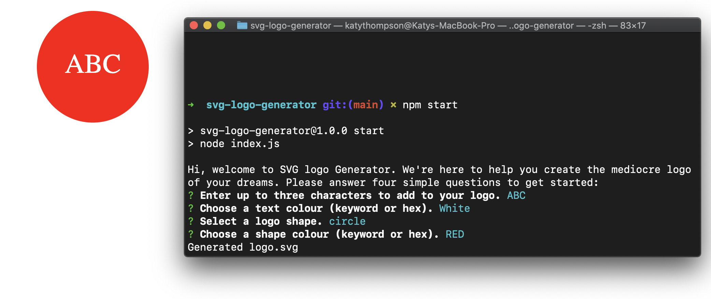

# SVG Logo Generator

## Badges

## Description
A command-line tool that can be used to generate a simple logo. The user is prompted to specify logo shape, text and colours, then an SVG logo file is generated based on their responses.

## Table of Contents
- [Features](#features)
- [Installation](#installation)
- [Usage](#usage)
- [Examples](#examples)
- [License](#license)
- [Tests](#tests)
- [Questions](#questions)

## Features
- Command-line prompts
- Auto-generated SVG logo

## Installation
1. Download the project repo
2. Ensure node.js and npm are installed on your computer
3. Navigate to the app directory via the command line
4. Use command 'npm i' to install module dependencies
5. Use command 'npm start' to initialise the app

## Usage
Once the app is initialised (via instructions above), the user will be prompted with four questions to specify the shape, text and colour attributes of their logo. The logo will then be auto-generated and added to the 'examples' folder.

## Examples
[Walkthrough Video](https://drive.google.com/file/d/16-2HZxDMxOBtHknuW8XJKFWtBfTVVBsx/view)

## License
All assets and code are under MIT License unless specified otherwise.

## Tests
Navigate to the app directory via the command line, then use command 'npm test' to validate shapes are being correctly generated.

## Questions
Any questions? Visit my GitHub profile at [https://github.com/katyjmt](https://github.com/katyjmt) or email me at [katyjmt@gmail.com](katyjmt@gmail.com).
